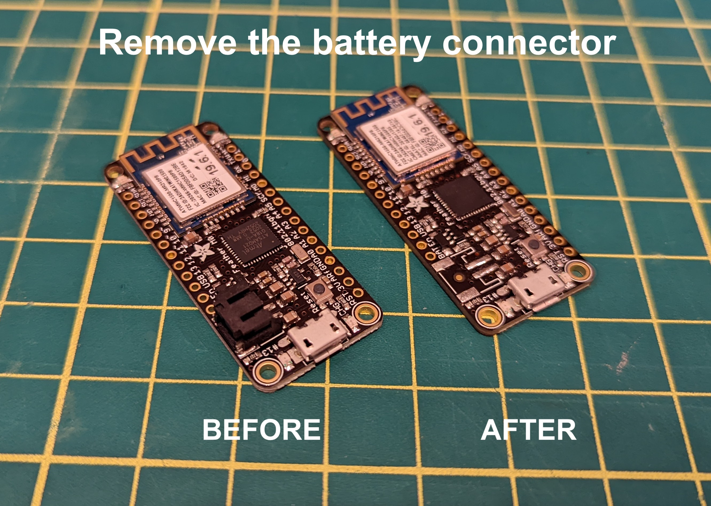
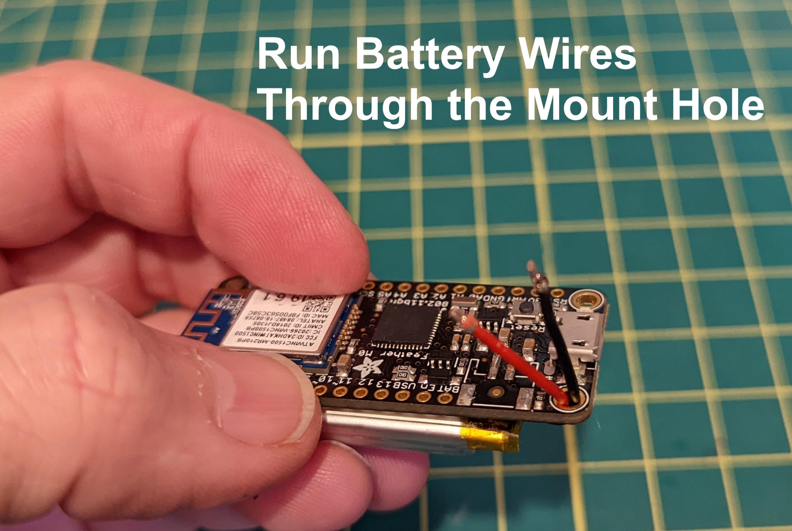
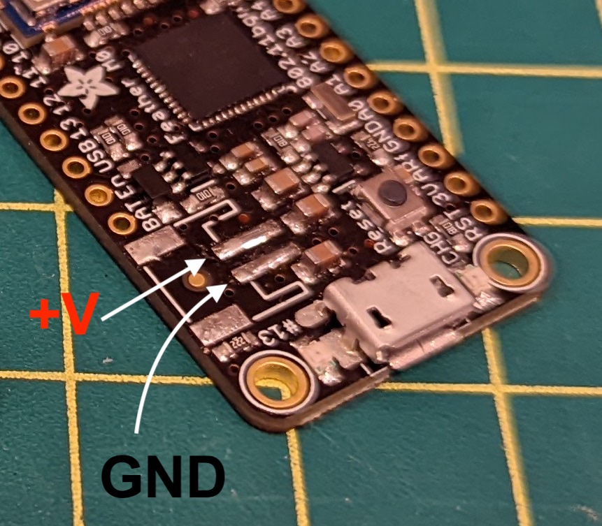

# EmotiBit Case NinjaFlex
This case exposes only the side velcro band slots.
This case designed to print in flexible filament.
This case allows access to:
 
- Emotibit SD Card Slot
- Emotibit Sleep Button
- Feather Reset Button 

## Print Settings

This case design was successfully printed on a TAZ Mini 2.

- NinjaTek Ninja Flex filament
- 20% Infill
- With Supports
- Standard Resolution

 
## Hardware Requirements

You must de-solder the battery connector on the Feather, and hard solder the battery wires to the Feather battery connector pads.

In order to protect the battery wires, it's best to route them through the Feather Mount Hole right next to the battery solder pads.

The black wire (GND) solders to the skinny pad closer to the USB port.
Red wire goes on the skinny pad further from the USB port.

Install the Feather + Emotibit into the case by first sliding in the USB end. Then stretch the case around the opposite end of the Feather + Emotibit assembly. It's kind of like putting on a bike tire. Best to use a spudger or other plastic tool to stretch against the PCBs. 

