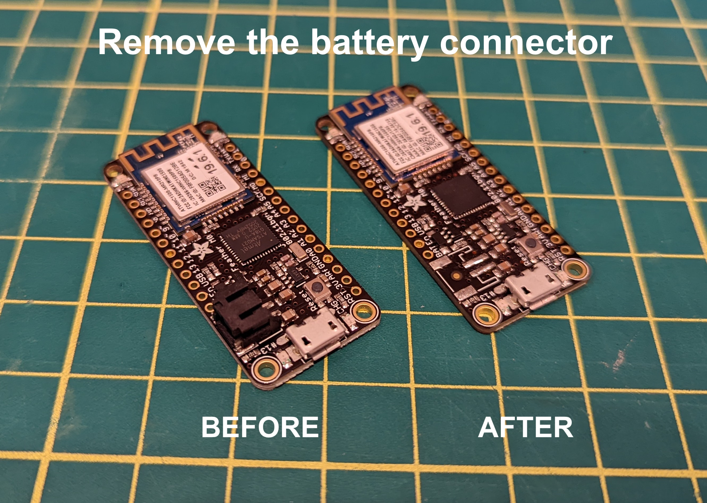
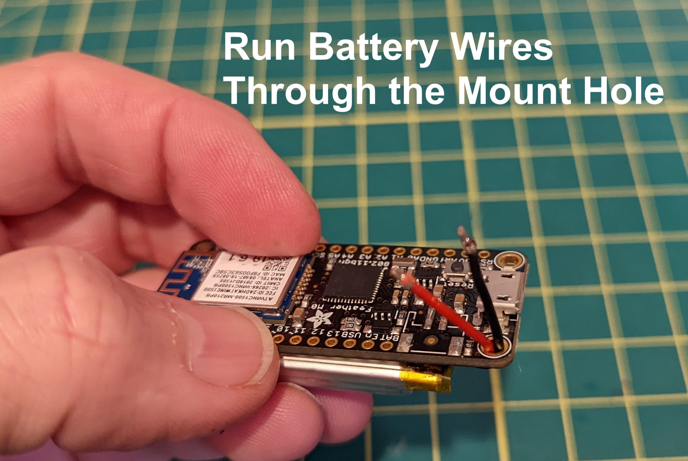
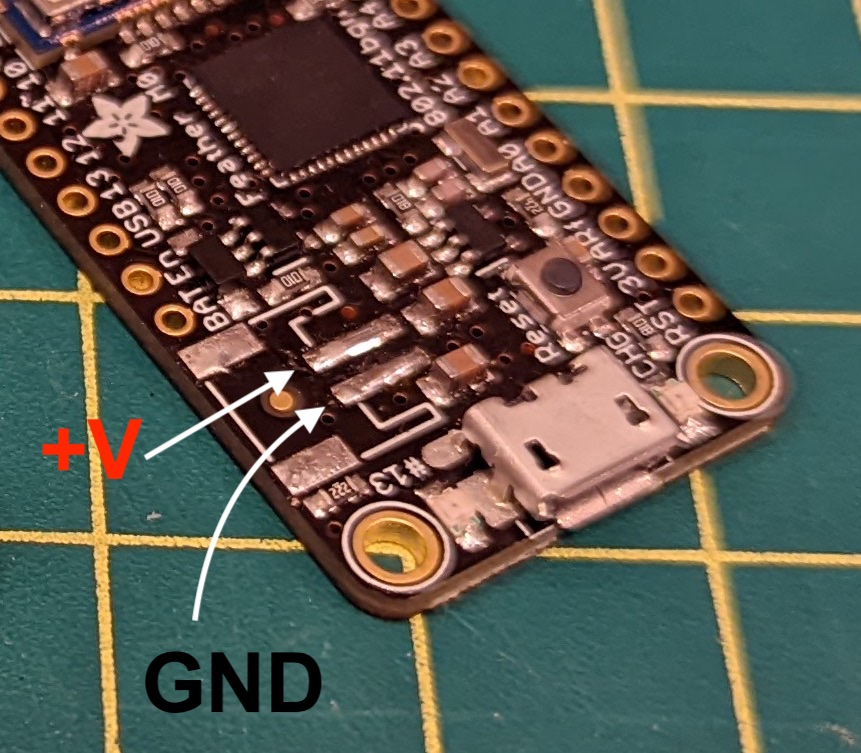

## Description
This case requires removing the battery connector. It exposes only the side velcro band slots. Designed to print in flexible filament.

## Preview

## EmotiBit Compatibility
<!--- This table is written in minified html to permit scraping into a sub-table in the root EmotiBit_Cases/readme.md -->
<table><tr><th>EmotiBit Version</th><th>Fit?</th></tr><tr><td>V01</td><td>Y?</td></tr><tr><td>V02</td><td>Y?</td></tr><tr><td>V03</td><td>Y?</td></tr><tr><td><a href=https://github.com/EmotiBit/EmotiBit_Cases/tree/feat-reorg-cases/EmotiBit_3D_Models/V04>V04</a></td><td>Y</td></tr></table>

## Feather Compatibility
<!--- This table is written in minified html to permit scraping into a sub-table in the root EmotiBit_Cases/readme.md -->
<table><tr><th>Feather Version</th><th>Fit?</th></tr><tr><td><a href=https://www.adafruit.com/product/2598>M0 WiFi Regular Header</a></td><td>Y*</td></tr><tr><td><a href=https://www.adafruit.com/product/3044>M0 WiFi Stacking Header</a></td><td>N</td></tr></table>

## Hardware Modifications
You must de-solder the battery connector on the Feather, and hard solder the battery wires to the Feather battery connector pads.

In order to protect the battery wires, it's best to route them through the Feather Mount Hole right next to the battery solder pads.

The black wire (GND) solders to the skinny pad closer to the USB port.
Red wire goes on the skinny pad further from the USB port.

Install the Feather + Emotibit into the case by first sliding in the USB end. Then stretch the case around the opposite end of the Feather + Emotibit assembly. It's kind of like putting on a bike tire. Best to use a spudger or other plastic tool to stretch against the PCBs. 

## 3D Printing
| Works? | Vendor/Printer | Material | Notes |
| :----: | ------ | ------ | ------ |
| Y | TAZ Mini 2 | NinjaTek Ninja Flex filament | 20% Infill. With Supports. Standard Resolution. |

## Additional Hardware
None

## Feature Accessibility
| Feature | Accessible? |
| ------ | :----: |
| SD card | Y |
| EmotiBit Button | Y |
| USB connector | Y |
| EmotiBit LEDs visible | Y |
| Feather LEDs visible | N |
| Short-edge EmotiBit strap slots | N |
| Long-edge EmotiBit "side" strap slots  | Y |
| Hibernate switch | N |
| Battery connector | Removed |
| Battery removal/replacement | Soldered |
| Feather reset button | With paperclip |
| Feather stacking header pins | N |

## Known Limitations
Some caution should be exercised when inserting/removing EmotiBit. It's a tight fit and it can damage the EmotiBit strap slots if you aren't careful.

## Credits
Designed by the Joel Murphy @biomurph
