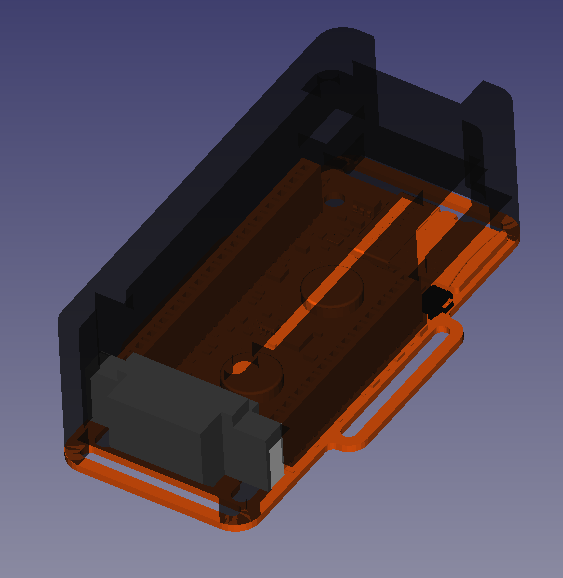

## Description
- This case has been designed keeping in mind the design requirements for EmotiBit V4 and extending compatibility with Adafruit Feather M0 with stacking headers.
- The hibernate switch slider has been designed to provide easy access to toggle the HIB switch(available on EmotiBit V4+).
  - The slider is printed as a separate part. You may use the case without the slider, but you  will need to use the spudger provided with 
    the Essentials Kit to access the HIB switch. 

## Preview

### Case

### Hibernate switch slider
The slider is shown below(in white)

 

## EmotiBit Compatibility
<!--- This table is written in minified html to permit scraping into a sub-table in the root EmotiBit_Cases/readme.md -->
<table><tr><th>EmotiBit Version</th><th>Fit?</th></tr><tr><td>V01</td><td>Y</td></tr><tr><td>V02</td><td>Y</td></tr><tr><td>V03</td><td>Y</td></tr><tr><td><a href=https://github.com/EmotiBit/EmotiBit_Cases/tree/feat-reorg-cases/EmotiBit_3D_Models/V04>V04</a></td><td>Y</td></tr></table>

## Feather Compatibility
<!--- This table is written in minified html to permit scraping into a sub-table in the root EmotiBit_Cases/readme.md -->
<table><tr><th>Feather Version</th><th>Fit?</th></tr><tr><td><a href=https://www.adafruit.com/product/2598>M0 WiFi Regular Header</a></td><td>Y</td></tr><tr><td><a href=https://www.adafruit.com/product/3044>M0 WiFi Stacking Header</a></td><td>Y</td></tr></table>

## Hardware Modifications
None required.

## 3D Printing
| Works? | Vendor/Printer | Material | Notes |
| :----: | ------ | ------ | ------ |
| Y | [shapeways](https://www.shapeways.com/) | Natural TPU (MJF) | Soft-touch finish. Somewhat flexible. Stays in place to some extent without screws. |
| Y | [shapeways](https://www.shapeways.com/) | Black Natural Versatile Plastic | Screws help hold case in place. |

### 3D Printing additional Notes
- We recommend using a hard material(like the versatile plastic) when printing the hibernate switch slider.
Since the part controls a moving component we dont want a deformation caused by the push/pull action.

## Additional Hardware
- [2x M2x25mm screws](https://www.digikey.com/en/products/detail/essentra-components/50M020040P025/11638319?s=N4IgTCBcDaIIwBYCsBaJAGAsus70PQAUdUA5AERAF0BfIA)
- [2x M2 nuts](https://www.digikey.com/en/products/detail/essentra-components/04M020040HN/9677098?s=N4IgTCBcDaIEoAUDCB2ADADgCwFoByAIiALoC%2BQA)

### Additional Hardware Notes
- M2.5 screws can also fit, but standard-size M2.5 nuts don't fit particularly well next to the stacking-header socket.

## Feature Accessibility
| Feature | Accessible? |
| ------ | :----: |
| SD card | Y |
| EmotiBit Button | Y |
| USB connector | Y |
| EmotiBit LEDs visible | Y |
| Feather LEDs visible | Y |
| Short-edge EmotiBit strap slots | Y |
| Long-edge EmotiBit strap slots  | Y |
| Hibernate switch(*without slider*/ **with slider**) | *Requires spudger* / **Y** |
| Battery connector | Y |
| Battery removal/replacement | Case must be partially removed |
| Feather reset button | Requires spudger |
| Feather stacking header pins | Y |

## Known Limitations
- Over-tightening the screws can cause EmotiBit PCB to bend somewhat (PLEASE BE CAREFUL TO NOT OVERTIGHTEN!)

## Credits
Designed by the EmotiBit team
